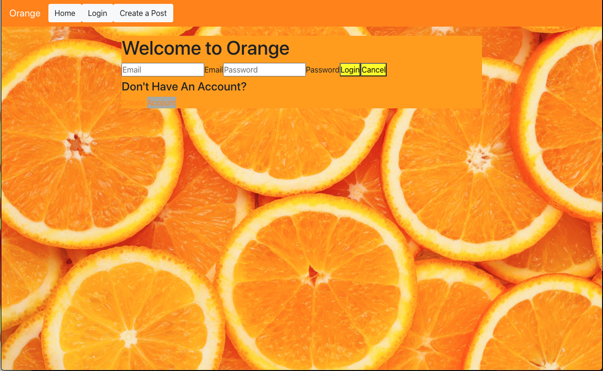
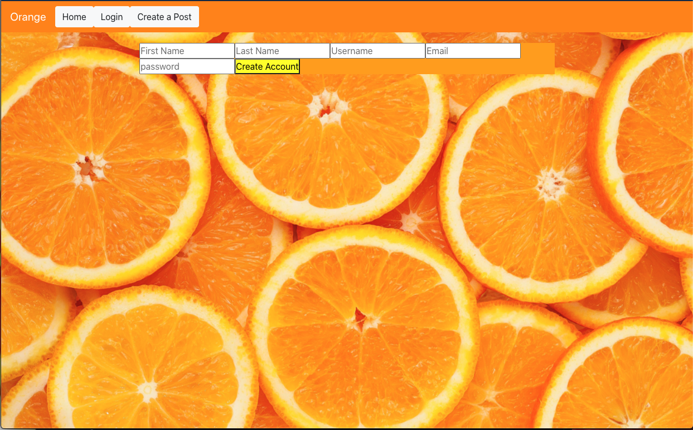

## Description
Orange is social media platform that allows users to share what they are thinking via short blurps of text displayed on a message-board! The Orange backend handles and stores login and registration request, user info, and post data.

## Screen Shots

## Instillation Steps
1. Fork and clone this repo
2. Cd into the project directory
3. Install project dependencies by running npm i 
4. Create a new feature branch and start working!

## Technologies 
- React
- Bootstrap
- Axios
- Api

## Challenges
- Creating new users.
- Making a login that checks if a user was actually part of the data base.
- Creating a new post.
- Having it so where it only shows the edit and delete button when its your post.
- Having it so the login button only shows when you are logged out.
